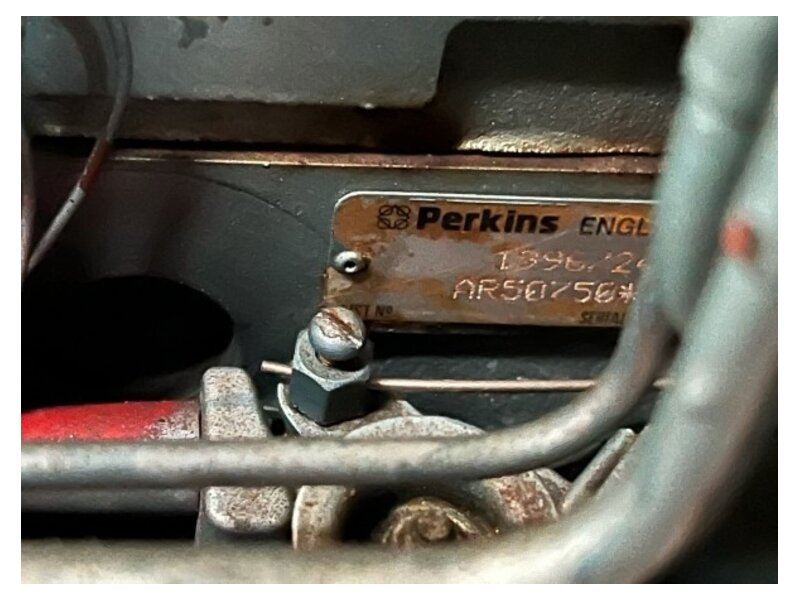
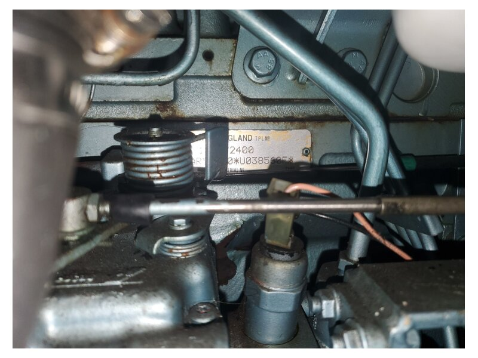
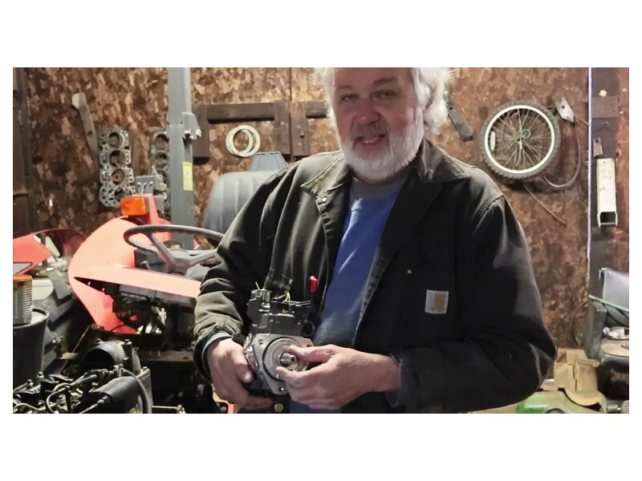
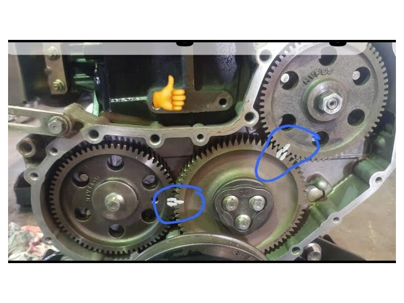
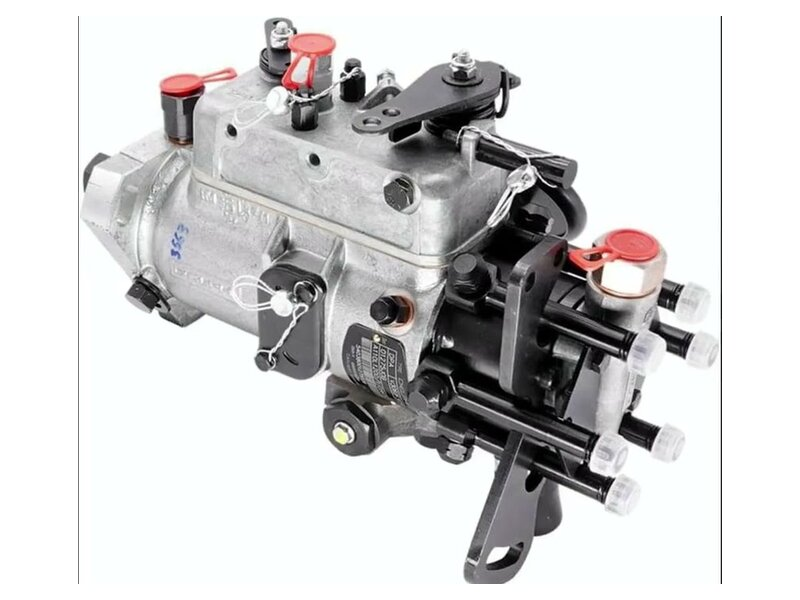

# Guide to the Perkins Sabre M92

Repair, service and tuning notes for the Perkins Sabre M92 marine
diesel, written around one specific engine: serial
`AR50750U038560F`, built in 1999.

Last updated: 2026-09-10.

---

## Table of contents

1. [Your engine, identified](#1-your-engine-identified)
2. [Available resources](#2-available-resources)
3. [What the M92 actually is](#3-what-the-m92-actually-is)
4. [Specification and data](#4-specification-and-data)
5. [Fluids and capacities](#5-fluids-and-capacities)
6. [Maintenance schedule](#6-maintenance-schedule)
7. [Routine service jobs](#7-routine-service-jobs)
8. [Tuning and adjustment](#8-tuning-and-adjustment)
9. [Torque figures](#9-torque-figures)
10. [Fault diagnosis](#10-fault-diagnosis)
11. [Known weak points on this engine](#11-known-weak-points-on-this-engine)
12. [Ordering parts](#12-ordering-parts)
13. [Laying up and winterising](#13-laying-up-and-winterising)
14. [Safety](#14-safety)

---

## 1. Your engine, identified

The photographs show the engine data plate, stamped on a plate at
the rear of the right hand side of the cylinder block. That is
exactly where the Perkins handbook says to look. Two numbers are
visible.





The plate sits low on the block behind the injection pump
linkage, partly masked by a bracket and a fuel pipe. Between the
two photographs the whole of both numbers can be read.

**Serial number: `AR50750*U038560F*`**

Perkins breaks this down as follows (the handbook uses
`AR30495U123456F` as its worked example, so the format matches
line for line):

| Part | Value | Meaning |
|---|---|---|
| Type code | `AR` | 1004-42, the base engine of the M92 |
| Build list | `50750` | The specific build specification |
| Country | `U` | Built in the UK |
| Serial | `038560` | Engine serial number |
| Year | `F` | Built between 1 April and 31 December 1999 |

Two independent Perkins documents confirm the type code. The
official *Engine Number Guide* lists `AR` against `1004-42`. The
M92 user handbook opens its identification section with the flat
statement: "M92 engine - identification letters AR". The M115T,
the turbocharged sister engine sharing the same handbook, is `AK`.

On the year letter, note the detail that catches people out: 1999
is split across two codes in the official table. `E` covers
1 January to 31 March 1999, and `F` covers 1 April to
31 December 1999. So this engine left the factory in the last
three quarters of 1999. Your working assumption of "1999 or 2000"
was right, and it lands on 1999.

**Second number: `1396/2400`**

This sits above the caption `TPL No` on the plate. Perkins does
not define "TPL" anywhere in its public literature, and I could
not find a source that decodes it, so I am not going to invent a
meaning for it. Treat it as part of the engine's identity and
quote it alongside the serial number whenever you order parts or
ask a distributor for literature. Perkins is explicit that a
finishing or build list shown on the plate must be quoted when
ordering spares.

The number to give a parts desk, in full:

```
AR50750U038560F        (TPL 1396/2400)
```

**What this buys you.** Knowing the code is `AR` is the whole
game. It means the correct factory repair manual is the *Perkins
New 1000 Series, Models AJ to AS and YG to YK Workshop Manual*,
publication TPD 1350E. `AR` sits inside the AJ to AS range. That
manual is in `resources/`, and it carries `AR` specific data
throughout, including a cylinder head tightening procedure written
for `AR` and `AS` alone. Everything in sections 4 and 9 below is
taken from it or from the M92 handbook, not from a generic
Perkins source.

One caution carried over from your earlier notes, now confirmed
rather than assumed: do not use M92B literature as your repair
reference. The M92B is a different engine on the 1100 Series
platform. It is worth having for comparison, and a copy is in
`resources/`, but the M92 and the M92B do not share a base engine.

---

## 2. Available resources

### Downloaded to `resources/`

| File | What it is | Why it matters |
|---|---|---|
| `perkins_1000_series_workshop_manual_TPD1350_AJ-AS_YG-YK.pdf` | Factory workshop manual, TPD 1350E Issue 4, December 2001, 370 pages | **The repair manual for your engine.** Covers type AR. Teardown, clearances, torques, timing, overhaul |
| `perkins_sabre_M92_M115T_users_handbook_TPD1397EGN.pdf` | Official M92 and M115T user handbook, TPD 1397EGN Issue 10, 96 pages | Marine specific: service schedule, fluids, raw water side, fault charts. English, German, Norwegian |
| `perkins_sabre_marine_installation_manual_TPD1317E.pdf` | Perkins Sabre installation manual, TPD 1317E, 94 pages | Cooling, exhaust, shaft, electrical and control installation. Useful when chasing an installation induced fault |
| `perkins_sabre_M92_sales_brochure.pdf` | Trans Atlantic Diesels M92 data sheet | One page summary of ratings and construction |
| `perkins_engine_number_guide.pdf` | Perkins Engine Number Guide, PP3000/05/15 | The official serial decoding tables used in section 1 |
| `perkins_sabre_M92B_users_handbook_N37347.pdf` | M92B handbook, part N37347, 64 pages | Comparison only. **Not** your engine |

Three of the PDFs are also present as extracted plain text
(`.txt`) so you can grep them from the command line. For example:

```bash
grep -n -i "valve tip clearance" resources/*.txt
```

### Official Perkins sources

- [Perkins marine user guides and manuals](https://www.perkins.com/en_GB/products/sectors/marine/user-guides-manuals.html)
- [Perkins operation and maintenance manuals](https://www.perkins.com/en_GB/aftermarket/operation-maintenance-manuals.html)
- [Find my engine number](https://shop.perkins.com/find-my-engine-number)
- Perkins My Engine app, for parts information tied to your serial
- Wimborne Marine Power Centre (Caterpillar Marine Power UK Ltd),
  22 Cobham Road, Ferndown Industrial Estate, Wimborne, Dorset
  BH21 7PW. This is where Perkins marine engines are engineered,
  and the M92 handbook is published under their name

### Manual libraries

- [ManualsLib: Perkins M92](https://www.manualslib.com/products/Perkins-M92-3590473.html)
- [Marine Diesel Basics: Perkins manuals](https://marinedieselbasics.com/diesel-engine-manuals/perkins-diesel-engine-manuals/)
- [Dieselmann.no manual archive](https://www.dieselmann.no/) (source of two of the PDFs above)
- [Boatdiesel PDF library](https://boatdiesel.com/) (subscription)

### Parts suppliers

- [Parts4Engines M92 collection](https://parts4engines.com/en-us/collections/perkins-m92-parts). Filters, pumps, impellers, service kits. Lists the Jabsco 29640-1101 bronze sea water pump as original equipment on the M92
- [Trans Atlantic Diesels](https://www.tadiesels.com/). US based Perkins marine specialist, also the source of the M92 data sheet
- [Lancing Marine](https://www.lancingmarine.com/). Perkins, PRM and Jabsco parts
- [Sabre Plant & Marine downloads](https://www.sabrepm.com/downloads). Can supply workshop and parts manuals
- [Maritimus](https://www.maritimusboote.de/Perkins-Sabre-marine-dengines-Spare-Parts). European Perkins Sabre spares

### Forums and owner discussion

- [DBA Barge Association: Perkins M92](https://barges.org/forum/barges/1309-perkins-m92). The best single thread on the M92's overcooling problem
- [DBA Barge Association: rattling M92B](https://barges.org/forum/barges/10178-rattling-trembling-perkins-sabre-m92b-engine). A cautionary tale, see section 11
- [YBW forum: Perkins Sabre M92 manuals](https://forums.ybw.com/threads/perkins-sabre-m92-manuals.218913/)
- [MarineEngine.com Perkins forum](https://www.marineengine.com/boat-forum/forums/perkins.41/)
- [Cruisers & Sailing Forums](https://www.cruisersforum.com/), searchable for Perkins injection pump work
- [Attainable Adventure Cruising: M92B report card](https://www.morganscloud.com/2010/10/23/perkins-m92b-review/). M92B, but the marine installation lessons carry over

### Video

Nobody has published a good M92 specific video series. The base
engine is common in agricultural and industrial machines, though,
so plenty of 1000 Series and 4.236 footage applies directly to the
mechanical work.

| Video | What it covers |
|---|---|
| [](https://www.youtube.com/watch?v=8O38u6g4p5M) | **[Perkins diesel engine timing marks in full HD](https://www.youtube.com/watch?v=8O38u6g4p5M)**<br>Shows the injector pump, camshaft, crank and idler gear marks |
| [](https://www.youtube.com/watch?v=rbKTiMVtINc) | **[Installing and timing an injection pump on a Perkins diesel](https://www.youtube.com/watch?v=rbKTiMVtINc)**<br>Full removal and refit sequence |
| [](https://www.youtube.com/watch?v=M_dtUUS81A0) | **[Perkins 4 cylinder diesel injection pump timing](https://www.youtube.com/watch?v=M_dtUUS81A0)**<br>Same cylinder count and layout as yours |
| [](https://www.youtube.com/watch?v=So6aybjCPsE) | **[Replacing the fuel injection pump, Perkins 1004-4T](https://www.youtube.com/watch?v=So6aybjCPsE)**<br>Closest to your engine family |

Also worth reading, though written rather than filmed:
[Foley Engines, how to time a Perkins engine](https://www.foleyengines.com/tech-tip-124-how-time-perkins-engine/).

Watch these for orientation, then do the job from TPD 1350E. The
videos will not have your pump variant or your torque figures.

---

## 3. What the M92 actually is

A four cylinder, naturally aspirated, direct injection marine
diesel of 4.233 litres, rated 91 hp at 2400 rpm. It replaced the
4.236, which had been sold in marine form as the M90, and it was
designed to drop into the same installation. Perkins claimed at
least 12,000 hours of service life before a basic overhaul.

The two things worth knowing about its construction, because they
change how you service it:

**Both water pumps are gear driven.** The fresh water and sea
water pumps run off gears, not a belt. The belt on the front of
your engine drives the alternator and nothing else. If the belt
snaps you lose charging, but you do not lose cooling. That was a
deliberate selling point over the 4.236.

**It has an electrical start retard.** The injection pump carries
a mechanism that holds injection fully advanced for starting and
then retards it to the normal running position as the engine warms
up. It starts to operate at 55 C coolant temperature. A green lamp
visible through a hole in the fuse panel cover tells you it is
working. This is not a fault light. Owners who have never read the
handbook sometimes chase it as one.

Heat is handled by a fresh water cooled exhaust manifold combined
with the inlet manifold and heat exchanger, with a cupro-nickel
tubestack. Lubrication runs through an inverted spin-on filter and
a disc type oil cooler.

The rating deserves a note. 91 hp at 2400 rpm is a low rated speed
for the displacement, and it is why the engine is long lived and
quiet. It also means there is no headroom worth chasing. Anyone
offering to "tune it up" by winding on fuel is trading engine life
for a couple of horsepower you cannot use. Tuning on this engine
means restoring it to specification, which is what section 8 is
about.

---

## 4. Specification and data

Figures below are for the M92 specifically, taken from TPD 1397EGN
and from the AR entries in TPD 1350E.

### Basic engine

| Item | Figure |
|---|---|
| Cylinders | 4, in line, four stroke |
| Induction | Naturally aspirated |
| Combustion | Direct injection (Fastram) |
| Bore | 103.00 mm (4.055 in) |
| Stroke | 127.0 mm (5.00 in) |
| Displacement | 4.233 litres (258 in3) |
| Compression ratio | 18.5:1 |
| Firing order | 1, 3, 4, 2 |
| Rotation | Clockwise viewed from the front |
| No. 1 cylinder | At the front of the engine |
| Maximum power | 91 hp at 2400 rpm |
| Weight, wet, engine only | 418 kg (921 lb) |
| Weight with PRM 500D | 499 kg (1100 lb) |
| Weight with ZF HSW 450A | 455 kg (1003 lb) |
| Operating angles, continuous | 20 deg bow up, 25 deg sideways (35 deg intermittent) |

Note the bore and compression ratio. They are the AR and AS
signature, and they are how you tell at a glance that a 1000
Series document applies to you. The AJ to AQ engines are 100 mm
bore and 17.25:1. If a specification table gives only those
figures, it is not describing your engine.

### Clearances and pressures

| Item | Figure |
|---|---|
| Valve tip clearance, inlet, hot or cold | 0.20 mm (0.008 in) |
| Valve tip clearance, exhaust, hot or cold | 0.45 mm (0.018 in) |
| Minimum oil pressure, max speed, hot | 207 kPa (30 lbf/in2), 2.1 kgf/cm2 |
| Compression, expected range | 2000 to 3500 kPa (300 to 500 lbf/in2) |
| Compression, maximum spread between cylinders | 350 kPa (50 lbf/in2) |
| Alternator belt deflection at 45 N (10 lbf) | 10 mm (3/8 in) |

The oil pressure figure is worth committing to memory, because it
is lower than most Perkins engines. AJ to AQ and the six cylinder
engines want 280 kPa (40 psi). Yours wants 207 kPa (30 psi)
minimum at maximum speed, at normal running temperature. A gauge
sitting at 32 psi hot on an AR is not a sick engine.

### Fuel system

| Item | Figure |
|---|---|
| Injection pump | Lucas rotary with electric and manual stop |
| Pump type in TPD 1350E | Lucas/Delphi DP200 Series, pin timed, with a locking screw |
| Governing | Mechanical, all speed |
| Atomisers | Valve covered orifice (VCO), five hole |
| Fuel filter | Single element, high mounted, spin-on |

The M92 data sheet says "Lucas rotary". TPD 1350E covers three
pump families across the 1000 Series: Bosch VE, Lucas/Delphi
DP200, and Stanadyne DB2/DB4. Before you touch timing, read the
plate on the pump itself and confirm which family you have. The
locking screw torque alone differs by a factor of nearly three
between the Bosch and DP200 pumps.

Atomiser setting pressures are not one number. Each atomiser
carries a two letter code stamped on the body just below the high
pressure pipe connection, and the code sets the pressure. The full
table is on page 31 of TPD 1350E. Most of the range sits at 290
atm (4263 lbf/in2), but codes run from 250 to 300 atm, so read
your code rather than assuming.

### Electrical

| Item | Figure |
|---|---|
| 12V system battery | One 12V, 520 A to BS3911 |
| 24V system battery | Two 12V, 440 A to BS3911 |
| Start retard operates at | 55 C (131 F) coolant |

### Gearbox

| Gearbox | Oil capacity | Oil specification |
|---|---|---|
| Newage PRM 500D | 2.5 litres (4.40 pints) | Engine oil, API CD or ACEA E2 |
| ZF HSW 450A | 2.0 litres (3.52 pints) | ATF |

Both capacities exclude the oil cooler and its pipes, and both
vary with installation angle. Fill to the dipstick, not to the
book figure.

---

## 5. Fluids and capacities

| Item | Capacity |
|---|---|
| Lubricating oil, including filter | 8.5 litres (16.5 pints) |
| Lubricating oil, sump only | 7 litres (15.8 pints) |
| Coolant, engine only | 8.75 litres (15.4 pints) |

Sump capacity changes with the angle the engine sits at. Never
fill past the "Full" mark on the dipstick regardless of what the
table says.

**Engine oil.** Naturally aspirated engines should use API CD or
ACEA E1 as a minimum. API CF4 or ACEA E2 can be used, but Perkins
does not recommend it during the first 20 to 40 hours, nor for
light load work. Match viscosity to your ambient temperature range
using the chart on page 61 of the handbook.

**Fuel.** Cetane 45 minimum. Viscosity 2.5 to 4.5 centistokes at
40 C. Density 0.835 to 0.855 kg/litre. Sulphur 0.2 % by mass
maximum. Distillation 85 % at 350 C. Fuel sulphur content changes
the oil change interval, so if you are buying fuel of unknown
quality, shorten the interval rather than argue about it.

**Coolant.** Renew antifreeze every two years. If you use a
coolant inhibitor instead of antifreeze, renew it every six
months. Perkins is firm that antifreeze concentration must be
maintained rather than topped up with plain water.

---

## 6. Maintenance schedule

From TPD 1397EGN. Apply whichever interval comes first, hours or
months.

- **A** First service at 25/50 hours
- **B** Every day or every 8 hours
- **C** Every 250 hours or 12 months
- **D** Every 500 hours or 12 months
- **E** Every 1000 hours
- **F** Every 2000 hours

| Operation | A | B | C | D | E | F |
|---|:-:|:-:|:-:|:-:|:-:|:-:|
| Check coolant level in header tank | | x | | | | |
| Check engine for oil and coolant leaks | | x | | | | |
| Check specific gravity of coolant | | | | x | | |
| Check tension and condition of drive belt | x | | x | | | |
| Check impeller of raw water pump | | | | x | | |
| Check sea water strainer | | x | | | | |
| Clean sediment chamber and strainer of fuel lift pump | | | | x | | |
| Drain water from fuel pre-filter | x | x | | | | |
| Renew fuel filter element | | | | x | | |
| Atomiser maintenance | | | | | | x |
| Check and adjust idle speed | x | | | | | |
| Check oil level in sump | | x | | | | |
| Check oil pressure at the gauge | | x | | | | |
| Renew engine lubricating oil | | | x | | | |
| Renew lubricating oil filter canister | | | x | | | |
| Check oil level in reverse gearbox | | x | | | | |
| Renew oil in reverse gearbox | x | | x | | | |
| Renew engine breather | | | | | | x |
| Renew air filter element | | | | x | | |
| Check all hoses and connections | | | | x | | |
| Check valve tip clearances, adjust if needed | x | | | | x | |
| Check audible warning system | | | | x | | |
| Check alternator, starter motor etc. | | | | | x | |
| Check engine mounts | | | | x | | |
| Inspect electrical system for damage | | | | | x | |

Jobs marked in the handbook as requiring trained personnel:
coolant specific gravity, atomiser work, idle speed, breather
renewal, valve clearances, alternator and starter checks,
electrical inspection.

The engine breather assembly is renewed complete at major service
or 8000 hours.

---

## 7. Routine service jobs

### Raw water pump impeller

Due every 500 hours or 12 months, and the single most common
reason an M92 stops in the middle of a passage.

1. Close the seacock. Confirm it, do not assume it.
2. Release the six setscrews holding the end plate and remove
   the plate. Some raw water will run out.
3. Remove the rubber end cap and pull the impeller off the shaft.
4. Clean the contact faces of the pump body and end plate.
5. Inspect the impeller for wear and damage. Renew it if in
   doubt. **If blades have broken off, you must find them.**
   Remove the outlet hose from the raw water pump, remove the
   end cap of the gearbox oil cooler, clear the debris, and check
   that the cooler tube ends are open. Refit the hose and end cap,
   tighten the clips, and top up the coolant circuit.
6. Apply Spheerol SX2 grease or liquid soap to the blades. Fit the
   impeller into the housing **with the blades bent clockwise**.
   Refit the rubber end cap.
7. Apply POWERPART jointing compound, part 1861117, to a new
   joint. Fit it with the wide area of the joint over the
   eccentric plate in the body. Fit the end plate and tighten.
8. Open the seacock.

Blade direction matters and the two handbooks in `resources/`
describe it in different words. The figure above is what your
manual, TPD 1397EGN, says for the M92. Carry a spare impeller and
a spare end plate joint aboard, and check the cam for wear while
you are in there.

The pump itself is a Jabsco 29640-1101 bronze unit as original
equipment.

### Fuel filter

Due every 500 hours or 12 months.

Lubricate the two top seals of the new canister with clean fuel.
Fit to the filter head and tighten **by hand, half to three
quarters of a turn**. Then bleed the system.

The handbook carries a specific warning here: the canister seals
must be fitted correctly or the injection pump can be damaged.
Some canisters ship with a seal held in place by a plastic clip.
Check it before you spin the filter on.

### Fuel pre-filter

Normally fitted between tank and engine. Check the bowl for water
regularly and drain as needed. This is a daily job in the schedule
and takes ten seconds.

### Drive belt

Press the belt at the centre of its longest free run with moderate
thumb pressure, 45 N (10 lbf). Correct deflection is 10 mm
(3/8 in).

To adjust: loosen the alternator pivot fastener and the two
setscrews on the adjustment link, move the alternator, retighten,
then check again. A new belt must be rechecked after the first 25
hours.

Use a Perkins POWERPART belt. The alternator drive uses a belt of
a specific section, and a generic substitute fails early.

### Finding a bad atomiser

Perkins does not schedule atomiser maintenance except at 2000
hours, and says nozzles should be renewed rather than cleaned, and
only when a fault appears.

To find which one is at fault, run the engine at fast idle. Loosen
and retighten the high pressure pipe union nut at each atomiser in
turn. When you loosen the nut on a defective atomiser, engine
speed barely changes.

High pressure fuel will penetrate skin. If it does, get medical
help immediately, do not wait to see how it develops.

---

## 8. Tuning and adjustment

Tuning an M92 means getting it back to the numbers in section 4.
There is nothing else to gain.

### Valve tip clearances

Inlet 0.20 mm (0.008 in), exhaust 0.45 mm (0.018 in), **hot or
cold**. That is a real convenience of this engine: you do not need
to catch it at a particular temperature.

Clearance is measured between the top of the valve stem and the
rocker lever. The valve sequence from number 1 cylinder at the
front is:

| Cylinder | 1 | 1 | 2 | 2 | 3 | 3 | 4 | 4 |
|---|---|---|---|---|---|---|---|---|
| Valve no. | 1 | 2 | 3 | 4 | 5 | 6 | 7 | 8 |
| Type | I | E | I | E | I | E | I | E |

The four cylinder procedure, TPD 1350E Operation 3-6, uses the
rocking pair method:

1. Turn the crankshaft in the normal direction until the inlet
   valve of number 4 (valve 7) has just opened and the exhaust
   valve of number 4 (valve 8) has not fully closed. Check and
   adjust valves 1 and 2 (cylinder 1).
2. Set number 2 rocking (valves 3 and 4). Check and adjust
   valves 5 and 6 (cylinder 3).
3. Set number 1 rocking (valves 1 and 2). Check and adjust
   valves 7 and 8 (cylinder 4).
4. Set number 3 rocking (valves 5 and 6). Check and adjust
   valves 3 and 4 (cylinder 2).

Adjusting screws on early engines take a screwdriver, later ones a
female Torx. The two types interchange, so do not be alarmed if a
replacement part looks wrong.

Rocker shaft bracket fasteners: 40 Nm (30 lbf ft) for aluminium
brackets, 75 Nm (55 lbf ft) for cast iron or sintered steel.
Getting this wrong distorts the shaft. Identify your bracket
material before you reassemble.

Rocker cover cap nuts: 20 Nm (15 lbf ft) for a composite plastic
cover, 30 Nm (22 lbf ft) for aluminium.

### Idle speed

The schedule asks for idle to be checked and adjusted at the
first service, by someone trained. Beyond that it is left alone.
Adjustment is at the injection pump, and on a marine installation
you also need to confirm the throttle cable is not preloading the
lever.

Both maximum no-load speed and idle live on the pump. The maximum
no-load speed for your engine is stamped on the emissions data
plate on the left side of the cylinder block. That is the number
to work to, not the rated 2400 rpm.

### Injection pump timing

Do not start here. Timing rarely drifts on its own. It changes
because someone removed the pump, or fitted a different gasket, or
disturbed the hub.

If you do need to go in, the essentials from TPD 1350E:

- The engine must be at TDC on number 1, compression stroke,
  before the pump goes on.
- **Do not slacken the nut on the pump hub.** The hub is set to
  the shaft at the factory to put the pump in the right position
  for timing. Move it, and it has to be reset with equipment only
  Perkins distributors have.
- Do not rotate the crankshaft with the pump off the engine. The
  loose pump gear can damage the timing case. If you must turn the
  engine, refit the pump temporarily, and when you do, release the
  locking screw and fit the spacer under it so the pump shaft is
  free.
- The DP200 pump is pin timed with a locking screw. Locking screw
  torque is 10 Nm (7 lbf ft) for a DP200, and 27 Nm (20 lbf ft)
  for a Bosch VE. Use the right one for your pump.
- Fuel pump gear fasteners: 28 Nm (20 lbf ft), setscrew or Torx.
  On engines with a belt driven coolant pump a special Torx socket
  is needed to get at them.
- High pressure pipe union nuts: 22 Nm (16 lbf ft).
- Inspect and if needed renew the O ring in the pump flange, and
  lubricate it with clean engine oil before fitting.

A well known trap on rotary pumps: the O rings inside the pump on
each injector body harden with age and change behaviour. That is a
pump shop job, not a dockside one.

### Compression testing

Set the valve clearances first. Then remove the atomisers, fit a
gauge into an atomiser hole, disconnect the stop solenoid or put
the stop control in the no-fuel position so the engine cannot
start, and crank.

Expect somewhere in 2000 to 3500 kPa (300 to 500 lbf/in2). The
absolute number means little, because battery condition, ambient
temperature and gauge type all move it. What matters is the spread
across the four cylinders. More than 350 kPa (50 lbf/in2) between
cylinders points at the low one.

Perkins is blunt about this: a compression test on its own does
not tell you the condition of an engine. Use it with other
symptoms.

---

## 9. Torque figures

### Cylinder head, engine types AR and AS

Your engine uses Operation 3-14, which is written specifically for
AR and AS. AJ to AQ engines use a different procedure. Do not
follow a 1000 Series head tightening sequence that does not name
your type code.

You will need an angle gauge, Perkins part 21825607, or you can
mark the head and fasteners and work to the marks.

1. Clean the head and block faces. Nothing in the bores.
2. Both location pins must be pressed into the block **before**
   the head goes on, or the head joint is damaged.
3. Fit the head joint dry. **No jointing compound.** It is stamped
   "FRONT TOP" for orientation.
4. Fit two M10 guide studs in positions 16 and 21, place the head,
   and make sure both location pins engage fully.
5. Lightly oil the setscrew threads and the underside of the
   heads. The four 1/2 UNF setscrews go in positions 2, 8, 13
   and 18.
6. Tighten all setscrews gradually and evenly to
   **45 Nm (33 lbf ft)** in sequence. Repeat the pass to confirm.
7. Tighten the four 1/2 UNF setscrews to **110 Nm (80 lbf ft)** in
   the order 2, 8, 13, 18. Repeat to confirm.
8. Angle tighten in sequence, by setscrew length:

| Setscrew | Further rotation |
|---|---|
| Short M10 (S) | 120 deg (2 flats) |
| Medium M10 (M) | 120 deg (2 flats) |
| Long M10 (L) | 150 deg (2.5 flats) |
| 1/2 UNF, positions 2, 8, 13, 18 | 180 deg (3 flats) |

Reset the valve clearances afterwards.

### Specific torques

Lightly oil fasteners with clean engine oil before fitting.

| Component | Thread | Nm | lbf ft |
|---|---|---|---|
| Rocker shaft brackets, aluminium | M12 | 40 | 30 |
| Rocker shaft brackets, cast iron / sintered | M12 | 75 | 55 |
| Rocker cover cap nuts, plastic cover | M12 | 20 | 15 |
| Rocker cover cap nuts, aluminium cover | M12 | 30 | 22 |
| Inlet manifold to head | M10 | 44 | 33 |
| Inlet manifold to head | M8 | 22 | 16 |
| Exhaust manifold to head | M10 | 33 | 24 |
| Engine lift bracket | M10 | 44 | 33 |
| Connecting rod nuts | 1/2 UNF | 125 | 92 |
| Connecting rod setscrews | 1/2 UNF | 152 | 114 |
| Piston cooling jet banjo bolts | 3/8 UNF | 27 | 21 |
| Main bearing setscrews | 5/8 UNF | 265 | 196 |
| Crankshaft pulley setscrews | 7/16 UNF | 115 | 85 |
| Rear oil seal housing to block | M8 | 22 | 16 |
| Timing case to block | M8 | 22 | 16 |
| Timing case to block | M10 | 44 | 33 |
| Idler gear hub | M10 | 44 | 33 |
| Camshaft gear setscrew | M12 | 95 | 74 |
| Timing case cover to case | M8 | 22 | 16 |
| High pressure fuel pipe nuts | M12 | 22 | 16 |
| Leak-off banjo bolt | M8 | 9 | 7 |
| Atomiser body gland nut | - | 40 | 30 |
| Fuel injection pump gear setscrews / Torx | M10 | 28 | 20 |
| Fuel lift pump setscrews | M8 | 22 | 16 |
| Fuel injection pump flange nuts | M8 | 22 | 16 |
| Locking screw, DP200 pump | 10 A/F | 10 | 7 |
| Locking screw, Bosch VE pump | M10 | 27 | 20 |
| Sump drain plug | 3/4 UNF | 34 | 25 |
| Oil pump to front bearing cap | M8 | 22 | 16 |
| Oil pump cover | M8 | 28 | 21 |
| Sump fasteners | M8 | 22 | 16 |

### Standard torques, setscrews and nuts

| Thread | Nm | lbf ft |
|---|---|---|
| M6 x 1.00 | 9 | 7 |
| M8 x 1.25 | 22 | 16 |
| M10 x 1.50 | 44 | 33 |
| M12 x 1.75 | 78 | 58 |
| M14 x 2.00 | 124 | 91 |
| M16 x 2.00 | 190 | 140 |

### Standard torques, pipe unions, plugs and adaptors

| Thread | Nm | lbf ft |
|---|---|---|
| 1/8 PTF | 9 | 7 |
| 1/4 PTF | 17 | 13 |
| 3/8 PTF | 30 | 23 |
| 3/4 PTF | 45 | 35 |

---

## 10. Fault diagnosis

The handbook splits causes into what an owner can check and what
belongs in a workshop. Numbers below match TPD 1397EGN pages 64
and 65.

### Symptom to cause

| Problem | Owner checks | Workshop checks |
|---|---|---|
| Starter turns engine too slowly | 1, 2, 3, 4 | |
| Engine does not start | 5, 6, 7, 8, 9, 10, 12, 13, 14, 15, 17 | 34, 35, 36, 37, 38, 42, 43, 44 |
| Engine hard to start | 5, 7, 8, 9, 10, 11, 12, 13, 14, 15, 16, 17, 19 | 34, 36, 37, 38, 40, 42, 43 |
| Not enough power | 8, 9, 10, 11, 12, 13, 16, 18, 19, 20, 21 | 34, 36, 37, 38, 39, 40, 41, 43, 63 |
| Misfire | 8, 9, 10, 12, 13, 15, 20, 22 | 34, 36, 37, 38, 39, 40, 41, 43 |
| High fuel consumption | 11, 13, 15, 17, 18, 19, 22, 23 | 34, 36, 37, 38, 39, 40, 42, 43, 44, 63 |
| Black exhaust smoke | 11, 13, 15, 17, 19, 21, 22 | 34, 36, 37, 38, 39, 40, 42, 43, 44, 63 |
| Blue or white exhaust smoke | 4, 15, 21, 23 | 36, 37, 38, 39, 42, 44, 45, 52, 58, 61, 62 |
| Oil pressure too low | 4, 24, 25, 26 | 46, 47, 48, 50, 51, 59 |
| Engine knocks | 9, 13, 15, 17, 20, 22, 23 | 36, 37, 40, 42, 44, 46, 52, 53, 60 |
| Engine runs erratically | 8, 9, 10, 11, 12, 13, 15, 16, 18, 20, 22, 23 | 36, 38, 40, 41, 44, 52, 60 |
| Vibration | 13, 18, 20, 27, 28 | 36, 38, 39, 40, 41, 44, 52, 54 |
| Oil pressure too high | 4, 25 | 49 |
| Oil temperature too high | 11, 13, 15, 19, 27, 29, 30, 32, 65, 66, 67, 68 | 34, 36, 37, 39, 52, 55, 56, 57, 69 |
| Crankcase pressure | 31, 33 | 39, 42, 44, 45, 52, 61 |
| Bad compression | 11, 22 | 37, 39, 40, 42, 43, 44, 45, 53, 60 |
| Engine starts and stops | 10, 11, 12 | |

Gearbox:

| Problem | Owner checks | Workshop checks |
|---|---|---|
| Delayed gear engagement | 70, 71 | |
| No transmission | 72 | 75 |
| Boat will not reach maximum speed | 73, 74 | 75, 76, 77 |

### Cause list

1. Battery capacity low
2. Bad electrical connections
3. Fault in starter motor
4. Wrong grade of lubricating oil
5. Starter motor turns engine too slowly
6. Fuel tank empty
7. Fault in stop solenoid, contacts or cables
8. Restriction in a fuel pipe
9. Fault in fuel lift pump
10. Dirty fuel filter element
11. Restriction in air induction system
12. Air in fuel system
13. Faulty atomisers, or atomisers of an incorrect type
14. Cold start system used incorrectly
15. Fault in cold start system
16. Restriction in fuel tank vent
17. Wrong type or grade of fuel
18. Restricted movement of engine speed control
19. Restriction in exhaust pipe
20. Engine temperature too high
21. Engine temperature too low
22. Incorrect valve tip clearances
23. Too much oil, or wrong oil, in wet type air cleaner if fitted
24. Not enough oil in sump
25. Defective gauge
26. Dirty lubricating oil filter element
27. Fan damaged
28. Fault in engine mounting or flywheel housing
29. Too much oil in sump
30. Restriction in air or water passages of radiator
31. Restriction in breather pipe
32. Insufficient coolant in system
33. Vacuum pipe leaks, or fault in exhauster
34. Fault in fuel injection pump
35. Broken drive on fuel injection pump
36. Timing of fuel injection pump is incorrect
37. Valve timing is incorrect
38. Bad compression
39. Cylinder head gasket leaks
40. Valves are not free
41. Wrong high pressure pipes fitted
42. Worn cylinder bores
43. Leakage between valves and seats
44. Piston rings not free, worn or broken
45. Valve stems or guides worn
46. Crankshaft bearings worn or damaged
47. Lubricating oil pump worn
48. Relief valve does not close
49. Relief valve does not open
50. Relief valve spring broken
51. Fault in suction pipe of lubricating oil pump
52. Piston damaged
53. Piston height incorrect
54. Flywheel housing or flywheel not aligned correctly
55. Fault in thermostat, or thermostat of incorrect type
56. Restriction in coolant passages
57. Fault in water pump
58. Valve stem seal damaged
59. Restriction in sump strainer
60. Valve spring broken
61. Breather assembly worn or broken
62. Vent hole for breather valve restricted
63. Leakage in the induction system
64. Spare
65. Drive belt for water pump loose
66. Restriction in the seacock or the raw water strainer
67. Insufficient coolant in circuit
68. Restriction in the heat exchanger or the oil cooler
69. Fault in raw water pump
70. Movement of gearbox control lever not equal both ways
71. Insufficient movement of gearbox control cable
72. Gearbox control cable not free, radii too small, or broken
73. Wrong type of oil in reverse gearbox
74. Gearbox oil cooler needed for the conditions of operation
75. Worn or broken drive components
76. Propeller wrong size or not matched
77. Propeller damaged

---

## 11. Known weak points on this engine

Four things come up again and again in owner discussion. None of
them are in the manuals, which is exactly why they are worth
writing down.

### Overcooling, not overheating

The M92 has a reputation for running cold rather than hot,
particularly at low revs. Owners on the DBA barge forum report
engines that reach 80 C and then sag back, or never get there at
all below about 1400 rpm. Above that the problem disappears.

Suspects, in the order worth checking:

- Thermostat stuck open, or a thermostat of the wrong rating.
  This is cause 55 in the fault list and it is the usual answer.
  One owner ended up replacing the whole header tank and exhaust
  manifold casting. Others have fitted an aftermarket 87 degree
  stat successfully.
- The plastic retaining ring not seating properly, letting water
  bypass the thermostat.
- Heat being taken off by a calorifier or cabin heating circuit
  faster than a lightly loaded engine can make it.
- On keel cooled installations, more cooling surface than the
  engine needs.
- No engine insulation on a light load installation.

A diesel run cold for long periods bores and glazes. If yours
will not hold temperature, treat it as a real fault rather than a
quirk.

### Corroded electrical connections that look mechanical

One M92B owner spent three months and six engineers, including a
Perkins specialist, on a rattling, trembling, stalling engine with
poor throttle response. Everyone assumed injection or a bearing.
The cause was a small corroded electrical plug. An electrician
found it in short order.

The lesson generalises to every marine diesel, and it belongs at
the top of your list, not the bottom. Before you pull anything
apart, unplug, inspect and reseat every connector you can reach.
Look especially at the stop solenoid circuit (cause 7) and the
start retard wiring. Salt air gets into plugs and produces
symptoms that read as mechanical.

### Starter solenoid contacts

Reported on marineengine.com: a copper disc inside the solenoid
making poor contact, giving a starter that turns the engine at
about half speed. That reads as a flat battery or a bad earth,
and it is neither. Worth knowing before you buy a starter motor.

### Impeller debris in the gearbox oil cooler

Covered in section 7, but it belongs here too. When an impeller
sheds blades on this engine, the pieces travel to the reverse
gearbox oil cooler. Fitting a new impeller without going after
the fragments leaves you with a cooling restriction and a fault
that appears weeks later, by which time nobody connects the two.

---

## 12. Ordering parts

Quote the full engine number every time. Perkins says so in the
handbook, and distributors will ask.

```
AR50750U038560F        (TPL 1396/2400)
```

Take a photograph of the plate and keep it on your phone. The
plate in the photographs above is already partly obscured by a
bracket and a fuel pipe, and it will not get easier to read.

Also useful to have ready when you call:

- Gearbox model and ratio (PRM 500D or ZF HSW/HBW 450A)
- Whether the panel is 12V or 24V
- Photographs of the injection pump side and of the heat exchanger
  and exhaust side

For the injection pump specifically, read and photograph the
plate on the pump itself. Pump part numbers do not follow from the
engine serial, and getting the wrong family wastes a trip.

Known original equipment:

| Part | Detail |
|---|---|
| Sea water pump | Jabsco 29640-1101, bronze |
| Cooling system cleaner | POWERPART Easy Flush, 21825001 |
| Raw water pump joint compound | POWERPART jointing compound, 1861117 |
| Gasket and flange sealant | POWERPART, 21820518 |
| Gasket remover | POWERPART aerosol, 21820116 |
| Head setscrew angle gauge | Perkins 21825607 |
| Bosch pump flange nut spanner | Perkins 21825964 |
| Injection pump timing pin | Perkins 27610032 |

Filter service kits covering air, fuel and oil for the M92 are
sold as a set, which is the easy way to buy them.

---

## 13. Laying up and winterising

Chapter 7 of TPD 1397EGN covers preservation properly. The part
people skip is the raw water side.

To put antifreeze through the raw water system:

1. Run the engine, drawing an antifreeze and water mix in through
   the raw water strainer from a container, swapping containers as
   they empty.
2. Once the mixture has circulated fully, stop the engine and
   refit the top of the raw water strainer.
3. Reconnect the hose to the raw water connection on the exhaust
   elbow.
4. **Put a label on the engine** telling whoever starts it next
   that there is antifreeze in the raw water system and it must be
   drained before the seacock is opened and the engine run.

That label is not decoration. The person who starts the engine in
spring may not be you.

Renew antifreeze in the fresh water circuit every two years. If
you use an inhibitor instead, every six months.

---

## 14. Safety

Short list, and all of it is in the handbooks.

- High pressure fuel penetrates skin. If it gets you, get medical
  help immediately. Do not wait.
- Stay clear of moving parts with the engine running. Several
  moving parts on a running diesel are effectively invisible.
- Before any compression test or cranking work, disconnect the
  stop solenoid or set the stop control to no-fuel so the engine
  cannot start.
- Close the seacock before opening the raw water pump, and check
  that you actually closed it.
- Some seals on this engine are Viton. Burnt Viton produces
  hydrofluoric acid residue. TPD 1350E has a section on handling
  it. Read it before you take a torch to anything.
- Never fill past the "Full" mark on the dipstick.

---

## Sources

- Perkins New 1000 Series Workshop Manual, Models AJ to AS and YG to YK, TPD 1350E Issue 4, December 2001
- Perkins M92 and M115T Marine Diesel Engines User's Handbook, TPD 1397EGN Issue 10, March 2013, Wimborne Marine Power Centre
- Perkins Sabre Marine Engines Installation Manual, TPD 1317E
- Perkins Engine Number Guide, publication PP3000/05/15
- [Trans Atlantic Diesels: Perkins Sabre M92 data sheet](http://www.tadiesels.com/releases/P-Sabre_M92.pdf)
- [Parts4Engines: Perkins M92 parts](https://parts4engines.com/en-us/collections/perkins-m92-parts)
- [DBA Barge Association: Perkins M92 thread](https://barges.org/forum/barges/1309-perkins-m92)
- [DBA Barge Association: rattling M92B thread](https://barges.org/forum/barges/10178-rattling-trembling-perkins-sabre-m92b-engine)
- [MarineEngine.com Perkins forum](https://www.marineengine.com/boat-forum/forums/perkins.41/)
- [Perkins marine technical information](https://www.perkins.com/en_GB/products/sectors/marine/user-guides-manuals.html)
- Engine data plate photographs, `images/engine-plate-closeup.jpg`, `images/engine-plate-wide.jpg`, `images/engine-plate-angle.jpg`
